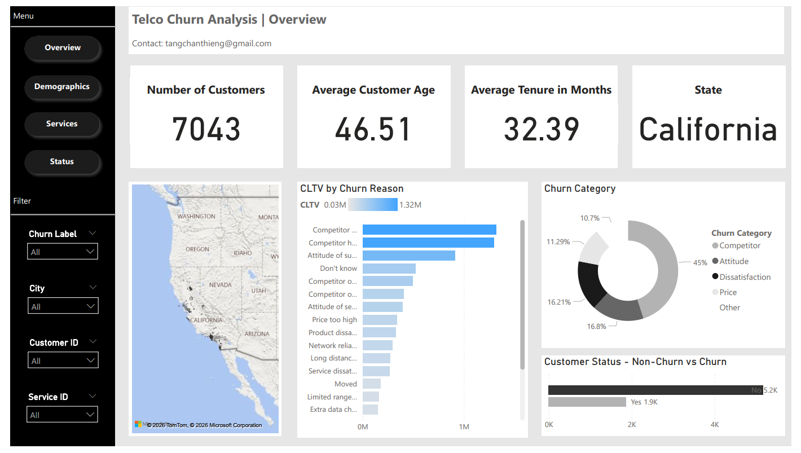

# Telco Customer Churn Prediction

**Technologies:** Python · Machine Learning · Power BI · Data Analysis

**Skills Demonstrated:** Predictive Analytics · Customer Segmentation · Revenue Impact Modeling · Data Visualization

---

# Project Overview

Customer churn is one of the most critical challenges in the telecommunications industry. Research suggests that acquiring a new customer can cost **5–25 times more than retaining an existing one**. As competition intensifies and switching barriers decrease, telecom companies must proactively identify customers at risk of leaving.

This project analyzes customer demographic, behavioral, and service usage data to:

* identify the **key drivers of customer churn**
* build a **predictive churn model**
* quantify the **financial impact of churn**
* recommend **data-driven retention strategies**

The objective is not only to **predict churn**, but to **enable proactive churn prevention and revenue protection**.

---

# Business Problem

Telecommunication companies face multiple churn-related challenges:

| Challenge                    | Business Impact                                           |
| ---------------------------- | --------------------------------------------------------- |
| Low switching barriers       | Customers can easily move to competitors                  |
| Aggressive competitor offers | Price and service competition increases churn risk        |
| Poor service experiences     | Negative customer interactions trigger cancellations      |
| Lack of predictive analytics | Retention strategies become reactive instead of proactive |

Without predictive insights, companies risk losing **high-value customers and recurring revenue**.

---

# Dataset Overview

The dataset contains customer information from a telecommunications company that provides phone and internet services.

| Metric                 | Value        |
| ---------------------- | ------------ |
| Total Customers        | 7,043        |
| Customers Churned      | 1,869        |
| Churn Rate             | 26.5%        |
| Average Tenure         | 32.39 months |
| Average Monthly Charge | $64.76       |
| Total Revenue          | $21.37M      |

Each row represents a **single customer**, while columns contain demographic attributes, service usage details, billing information, and satisfaction scores.

### Target Variable

| Variable    | Description                                     |
| ----------- | ----------------------------------------------- |
| Churn Label | Indicates whether the customer left the company |
| Churn Value | Binary value (1 = churned, 0 = retained)        |

---

# Dataset Categories

The dataset integrates multiple types of customer information.

| Data Category   | Description                                           |
| --------------- | ----------------------------------------------------- |
| Demographics    | Age, gender, marital status, dependents               |
| Location        | Customer geographic information                       |
| Population      | Zip-code level population estimates                   |
| Services        | Service subscriptions and usage behavior              |
| Billing         | Monthly charges, total charges, refunds               |
| Customer Status | Satisfaction scores, churn probability, churn reasons |

---

# Key Features Used in Analysis

| Feature                 | Description                                             |
| ----------------------- | ------------------------------------------------------- |
| Tenure in Months        | Length of time the customer has stayed with the company |
| Contract                | Contract type (Month-to-month, 1-year, 2-year)          |
| Internet Service        | DSL, Fiber Optic, Cable                                 |
| Monthly Charge          | Total monthly service charges                           |
| Avg Monthly GB Download | Internet usage behavior                                 |
| Satisfaction Score      | Customer satisfaction rating (1–5)                      |
| Churn Score             | Model-generated churn probability                       |
| CLTV                    | Predicted customer lifetime value                       |

Redundant attributes were removed during the data preparation phase.

---

# Project Workflow

The project follows a standard **data analytics and machine learning pipeline**.

| Stage                     | Description                                           |
| ------------------------- | ----------------------------------------------------- |
| Data Cleaning             | Handle missing values and remove duplicate attributes |
| Exploratory Data Analysis | Identify churn patterns and correlations              |
| Feature Engineering       | Transform variables for predictive modeling           |
| Predictive Modeling       | Train machine learning churn models                   |
| Visualization             | Develop an interactive Power BI dashboard             |
| Business Insights         | Translate findings into actionable strategies         |

---

# Key Insights from Exploratory Analysis

## Contract Structure

| Contract Type  | Share of Customers |
| -------------- | ------------------ |
| Month-to-Month | 51%                |
| One-Year       | 22%                |
| Two-Year       | 27%                |

**Insight:**
Month-to-month contracts show significantly higher churn risk due to lower commitment.

---

## Top Churn Drivers

| Churn Reason                      | Customers |
| --------------------------------- | --------- |
| Competitor offered better devices | 313       |
| Competitor made better offer      | 311       |
| Competitor offered more data      | 117       |
| Competitor offered higher speeds  | 100       |

**Insight:**
Competitor-driven churn is the **largest contributor to customer loss**, indicating the importance of competitive pricing and service offerings.

---

## Customer Service Issues

| Issue                        | Customers |
| ---------------------------- | --------- |
| Attitude of support person   | 220       |
| Attitude of service provider | 94        |

This suggests that **customer experience and service quality play a major role in retention**.

---

# Predictive Modeling

Machine learning models were applied to estimate churn probability.

| Model               | Purpose                           |
| ------------------- | --------------------------------- |
| Logistic Regression | Baseline classification model     |
| Random Forest       | Captures non-linear relationships |
| Gradient Boosting   | Improves prediction accuracy      |

The models generate **churn scores**, allowing companies to prioritize retention strategies for high-risk customers.

High-priority customers are typically those with:

* **High churn probability**
* **Low satisfaction scores**
* **High customer lifetime value (CLTV)**

---

# Power BI Dashboard

An interactive Power BI dashboard was developed to visualize churn patterns and customer segments.

### Key Dashboard Metrics

| Metric                 | Value        |
| ---------------------- | ------------ |
| Total Customers        | 7,043        |
| Churned Customers      | 1,869        |
| Average Tenure         | 32.39 months |
| Average Monthly Charge | $64.76       |

### Dashboard Insights

The dashboard enables analysis of:

* churn by **contract type**
* churn by **customer demographics**
* churn by **service usage**
* churn by **satisfaction levels**
* churn by **competitor factors**

---

# Strategic Recommendations

## 1. Competitor-Based Retention Strategy

| Action                  | Strategy                                                |
| ----------------------- | ------------------------------------------------------- |
| Early retention offers  | Trigger incentives before cancellation occurs           |
| Service bundles         | Combine devices, unlimited data, and streaming services |
| Speed-tier optimization | Improve high-speed internet plans                       |

---

## 2. Contract Optimization Strategy

| Strategy           | Implementation                                           |
| ------------------ | -------------------------------------------------------- |
| Upgrade incentives | Encourage month-to-month users to adopt longer contracts |
| Loyalty rewards    | Provide benefits at 6, 12, and 24-month milestones       |

---

## 3. Customer Service Improvements

| Strategy                   | Implementation                                 |
| -------------------------- | ---------------------------------------------- |
| Agent-level KPI tracking   | Monitor churn risk after support interactions  |
| Satisfaction alerts        | Escalate customers with satisfaction score ≤ 2 |
| Proactive service recovery | Flag customers with multiple support calls     |

---

## 4. Pricing Strategy

| Strategy                     | Implementation                                 |
| ---------------------------- | ---------------------------------------------- |
| Billing transparency         | Provide clear billing simulation tools         |
| Loyalty discounts            | Target high-value customers                    |
| Paperless billing incentives | Reduce operational costs and improve retention |

---

# Revenue Impact Analysis

### Scenario 1 – Reduce Churn by 5%

| Metric                    | Value    |
| ------------------------- | -------- |
| Customers Retained        | ~350     |
| Monthly Revenue Preserved | $22,666  |
| Annual Revenue Preserved  | $272,000 |

---

### Scenario 2 – Extend Customer Tenure by 6 Months

| Metric                          | Value     |
| ------------------------------- | --------- |
| Additional Revenue per Customer | $388      |
| Total Revenue Increase          | ~$135,800 |

---

### Scenario 3 – Protect High CLTV Customers

| Metric             | Value     |
| ------------------ | --------- |
| Customers Retained | 200       |
| Average CLTV       | $4,500    |
| Revenue Protected  | ~$900,000 |

---

# Estimated Business Impact

| Source              | Revenue Impact |
| ------------------- | -------------- |
| Churn Reduction     | $272,000       |
| Tenure Extension    | $135,800       |
| High-CLTV Retention | $900,000       |

**Total Estimated Revenue Impact**

≈ **$1.3M within a 12–24 month horizon**

On a **$21.37M revenue base**, this represents approximately **6% potential revenue growth without additional customer acquisition spending**.

---

# Key Takeaway

The most effective churn strategy is not simply reducing churn volume.

The real opportunity lies in **identifying and protecting high-value customers before they leave**.

Retention efforts should prioritize customers with:

* high **CLTV**
* high **churn probability**
* low **satisfaction scores**

---

# Author

**Chan Thieng Tang**

Master of Business Analytics

Data Analytics | Business Intelligence

Contact: tangchanthieng@outlook.com
